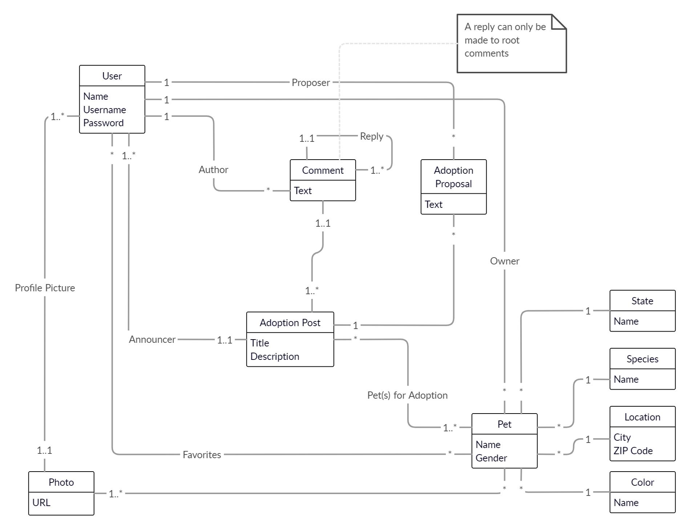
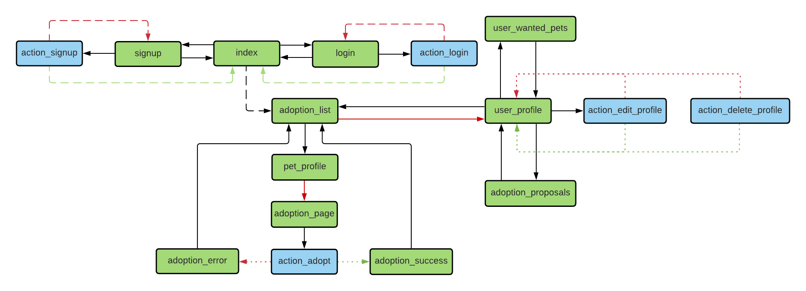

# Helper Shelter

Repository for the project of group 12 for the LTW's classes.

## Database

[](https://app.creately.com/diagram/qilCyc2EWYk/edit)

## Navigation

[](https://lucid.app/invitations/accept/6660a0dd-ec67-4d0e-b2dc-eb85346cd84a)

## Code Organization

- 📂 **api** - Interface between PHP and HTTP requests, mainly for AJAX 
- 📂 **actions** - 
- 📂 **database** - Database queries, connection and storage
- 📂 **images** - Images 
- 📂 **scripts** - Javascript scripts
- 📂 **style** - CSS stylesheets
- 📂 **templates** - HTML templates for the main pages to use
    - 📂 **cards** - Card templates
    - 📂 **forms** - Form templates

## Input Verification

### Username

Minimum four characters, maximum 20 characters.

```
ltw2020 ✔️
ltw ❌ 
```

#### Regular expression

`[\w]{4,20}`

### Name 

First and last name, separated by a single space.

```
Eduardo Correia ✔️
EduardoCorreia ❌ 
Eduardo 3 ❌
```

#### Regular expression

`([a-zA-Z]{2,}\s[a-zA-Z]{1,}'?-?[a-zA-Z]{2,}\s?([a-zA-Z]{1,})?)`

### Password

Minimum eight characters, at least one special character, one lowercase/uppercase letter and one number.

```
ltw2020! ✔️
12345678 ❌ 
abc ❌ 
```

#### Regular expression

`(?=.*[A-Za-z])(?=.*\d)(?=.*[@$!%*#?&_])[A-Za-z\d@$!%*#?&_]{8,}`
